> SPDX-License-Identifier: MPL-2.0
> Copyright © 2026 Cristian Camargo Filho


# @harness-lens/core

Provider-neutral contracts and deterministic analysis for Harness Lens. The
repository contains the reference Rust engine and retains the TypeScript package
for existing npm consumers.

| Implementation | Role | Package |
| --- | --- | --- |
| [`rust/`](rust/) | Reference domain and analysis engine | `harness-lens-core` |
| [`src/`](src/) | TypeScript compatibility implementation | `@harness-lens/core` |

Recognized inputs:

- `AGENTS.md`
- `CLAUDE.md`
- `GEMINI.md`
- `.github/copilot-instructions.md`
- `.cursor/rules/*`

```ts
import { scanRepository } from "@harness-lens/core";

const report = await scanRepository(process.cwd(), {
  profile: "coding-agent/v1",
});
```

For repeated-call evaluation, callers may provide an input price and expected
invocation count:

```ts
const report = await scanRepository(process.cwd(), {
  evaluation: {
    inputCostPerMillionTokens: 2.5,
    invocations: 100,
    costReference: "provider/model-input-rate",
  },
});
```

Coverage is evaluated only when an explicit profile is selected. Token cost remains
`not-evaluated` until callers supply an input price; when supplied, the report
calculates input cost per invocation and across the configured invocation count.
The token estimate is a heuristic (`ceil(character count / 4)`) and is not a
replacement for the target model tokenizer.

Exact duplicate rule `HL032` reports the later location and a `related` earlier
location. Its normalization assumption is explicit in finding evidence: case is
folded, surrounding and repeated whitespace are normalized, Markdown markers
are removed, and fenced code is ignored. `HL050` and `HL051` identify sources
over soft byte and token budgets, respectively.

See the [rule index](docs/rules.md) for every stable `HL` finding code,
assumption, and implementation source.

## Pipeline

```text
discover → load → normalize → validate → measure → snapshot → compare → render
```




```mermaid
flowchart TD

subgraph group_discovery["Discovery"]
  node_discovery_api["Harness discovery API<br/>[index.ts]"]
end

subgraph group_editor["VS Code Extension"]
  node_extension["Extension controller<br/>[extension.ts]"]
  node_settings["Provider settings"]
  node_server_path["Server resolver"]
end

subgraph group_evidence["Evidence Services"]
  node_provider_service["Provider protocol"]
  node_observed_service["Observed-flow protocol"]
end

subgraph group_presentation["Observability UI"]
  node_center["Observability center<br/>[center.ts]"]
  node_model["Report and history model<br/>[center-model.ts]"]
  node_view["Metrics center view<br/>[center-view.ts]"]
end

node_developer(("Developer"))
node_workspace["Workspace files"]
node_vscode["VS Code"]
node_language_server["Harness language server"]
node_codeburn["CodeBurn provider"]

node_developer -->|"uses"| node_vscode
node_vscode -->|"activates"| node_extension
node_extension -->|"classifies paths"| node_discovery_api
node_workspace -->|"scans and opens"| node_extension
node_extension -->|"resolves command"| node_server_path
node_extension -->|"resolves policy"| node_settings
node_extension -->|"starts"| node_language_server
node_extension -->|"opens and refreshes"| node_center
node_extension -->|"requests catalog"| node_provider_service
node_extension -->|"requests flow"| node_observed_service
node_provider_service -->|"sends protocol requests"| node_language_server
node_observed_service -->|"requests flow data"| node_language_server
node_center -->|"validates and summarizes"| node_model
node_center -->|"renders reports"| node_view
node_center -->|"requests workspace evidence"| node_language_server
node_center -->|"stores history locally"| node_vscode
node_language_server -.->|"optionally obtains runtime evidence"| node_codeburn
node_settings -->|"initializes provider policy"| node_language_server

click node_discovery_api "https://github.com/harness-lens/harness-lens-vscode/blob/main/packages/vscode/src/index.ts"
click node_extension "https://github.com/harness-lens/harness-lens-vscode/blob/main/packages/extension/src/extension.ts"
click node_settings "https://github.com/harness-lens/harness-lens-vscode/blob/main/packages/extension/src/provider-settings.ts"
click node_server_path "https://github.com/harness-lens/harness-lens-vscode/blob/main/packages/extension/src/language-server-path.ts"
click node_provider_service "https://github.com/harness-lens/harness-lens-vscode/blob/main/packages/extension/src/provider-service.ts"
click node_observed_service "https://github.com/harness-lens/harness-lens-vscode/blob/main/packages/extension/src/observed-flow-service.ts"
click node_center "https://github.com/harness-lens/harness-lens-vscode/blob/main/packages/extension/src/center.ts"
click node_model "https://github.com/harness-lens/harness-lens-vscode/blob/main/packages/extension/src/center-model.ts"
click node_view "https://github.com/harness-lens/harness-lens-vscode/blob/main/packages/extension/src/center-view.ts"

classDef toneNeutral fill:#f8fafc,stroke:#334155,stroke-width:1.5px,color:#0f172a
classDef toneBlue fill:#dbeafe,stroke:#2563eb,stroke-width:1.5px,color:#172554
classDef toneAmber fill:#fef3c7,stroke:#d97706,stroke-width:1.5px,color:#78350f
classDef toneMint fill:#dcfce7,stroke:#16a34a,stroke-width:1.5px,color:#14532d
classDef toneRose fill:#ffe4e6,stroke:#e11d48,stroke-width:1.5px,color:#881337
classDef toneIndigo fill:#e0e7ff,stroke:#4f46e5,stroke-width:1.5px,color:#312e81
classDef toneTeal fill:#ccfbf1,stroke:#0f766e,stroke-width:1.5px,color:#134e4a
class node_discovery_api toneBlue
class node_extension,node_settings,node_server_path toneAmber
class node_provider_service,node_observed_service,node_language_server toneMint
class node_center,node_model,node_view toneRose
class node_developer,node_workspace,node_vscode,node_codeburn toneIndigo
```

This `0.0.x` API is intentionally small and may change before `1.0.0`.

## Ecosystem

Core owns pure domain behavior. Integration surfaces live in separate
repositories and depend inward on these contracts:

- [SDK](https://github.com/harness-lens/sdk) — embedding, configuration, Python, and discovery adapters
- [CLI](https://github.com/harness-lens/cli) — terminal interface
- [Language Server](https://github.com/harness-lens/language-server) — editor diagnostics
- [VS Code](https://github.com/harness-lens/harness-lens-vscode) — editor presentation
- [Harness Lens](https://github.com/harness-lens/harness-lens) — ecosystem documentation and pinned repository composition

## Development

```bash
npm install
npm test
npm run check
npm pack

cd rust
cargo fmt --check
cargo clippy --all-targets --all-features -- -D warnings
cargo test --all-features
```

## License

Early namespace-reservation versions used BSD-3-Clause. The official functional
implementation is licensed under MPL-2.0. Harness Lens Core is the shared
deterministic core of the ecosystem; when Covered Software is distributed,
modified MPL-covered core files must remain available in Source Code Form under
the license. See [LICENSING](LICENSING.md), [COPYRIGHT](COPYRIGHT), and
[TRADEMARKS](TRADEMARKS).
